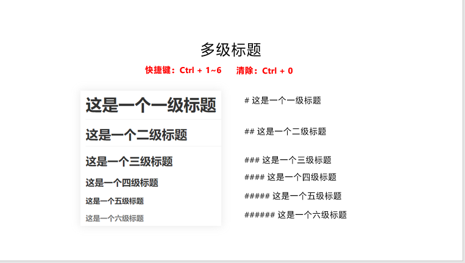
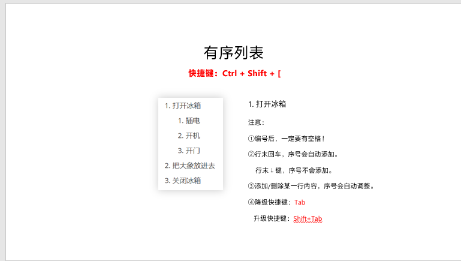
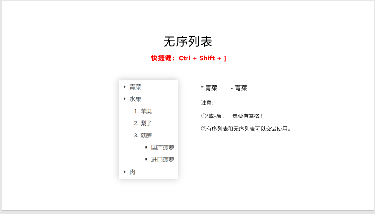
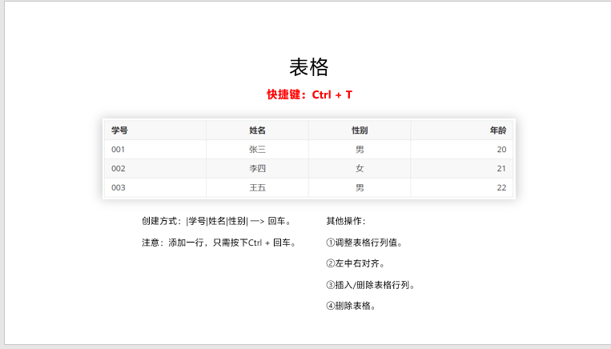
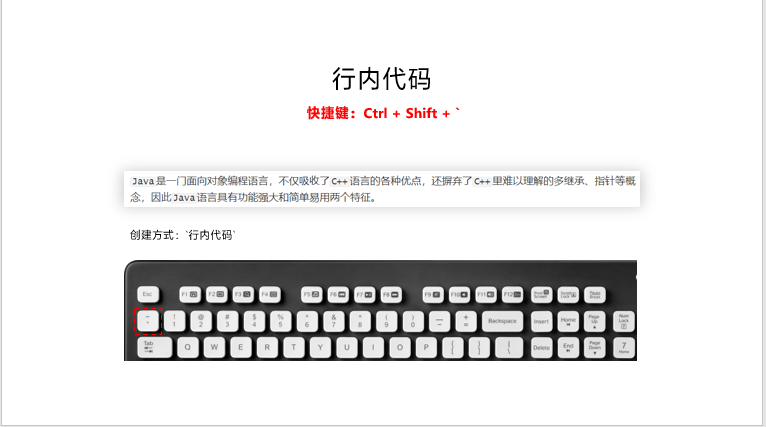
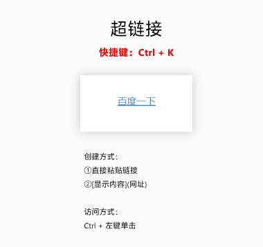

# 1.这是一个一级标题

##  1.1这是一个二级标题

#空格是一级标题 ##空格是二级标题

ctrl+1~6快捷键    ctrl+0清除



### 1.1.1 三级标题

## 1.2推荐快捷键


# 2.有序列表

## 2.1普通有序列表

1. 打开冰箱
2. 把大象放进去
3. 关闭冰箱

1. 第一步
2. 第二步
3. 第三步

## 2.2多级有序列表


1. 打开冰箱

   1. 插电
   2. 开机
   3. 开门

2. 把大象放进去

3. 关闭冰箱

   ## 2.3推荐快捷键

   


# 3.无序列表

## 3.1无序和有序列表混用

- 青菜
  1. 苹果
  2. 梨子
  3. 菠萝
     - 国产菠萝
     - 进口菠萝
- 水果
- 肉

## 3.2推荐快捷键




# 4.任务列表

## 4.1无快捷键，推荐段落选择任务列表

- [ ] 引导
- [ ] 讲解
- [ ] 选择


# 5.表格

## 5.1表格展示

| 学号 | 姓名 | 性别 | 年龄 |
| ---- | ---- | :--- | :--- |
| 001  | 张三 | 男   | 20   |
| 002  | 李四 | 男   | 21   |


## 5.2推荐使用快捷键




# 6.行内代码

`java`是一门面向对象编程语言，不仅吸收了`C++`语言的各种优点



## 6.1推荐使用代码


# 7.代码块

```javascript
function add(x,y){
	console.log(x+y);
}
```

## 7.1推荐使用代码创建

 三个反引号加上语言


# 8.图片


## 8.1推荐使用快捷键


# 9.超链接

## 9.1直接复制粘贴链接




# 10.水平分割线

三个下划线_ + enter 

___

## 10.1推荐代码


# 11.引用

> 横眉冷对千夫指，俯首甘为孺子牛。 --鲁迅

大于号后面加引用的内容

## 11.1推荐代码

